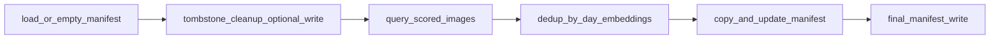

# Backup feature specification (Gallery)

Canonical specification for the **Backup** feature in **image-scoring-gallery** (Electron main process, DB layer, preload, `BackupModal`). File references are repo-relative.

## Overview

Backup exports high-quality originals from the indexed gallery database to a user-chosen folder (often an external drive). Unlike a simple copy, it applies **priority-based deduplication** within **calendar-day groups** (embedding similarity, keep best score). Day boundaries come from **database capture dates** (`COALESCE` EXIF + `created_at`), with a **path-regex fallback** when needed. The backup tree stays aligned with the gallery by **removing files** that correspond to **tombstoned** (`deleted_images`) rows.

Runs proceed in phases: load manifest → optional tombstone cleanup (with possible manifest write) → query candidates → deduplicate → copy → final manifest write.

---

## 1. Purpose and scope

**Backup** copies originals that pass filters from the gallery database to a **user-chosen folder**. It:

- Filters by **minimum general quality score** (`score_general` in PostgreSQL; exposed as `composite_score` in backup types).
- **Deduplicates** near-duplicates **per calendar-day group** (see §7) using **embedding similarity** (pgvector), keeping the **highest-scoring** image in each similarity cluster.
- Maintains **`manifest.json`** at the backup root for **incremental** runs (skip when manifest + on-disk size agree) and **housekeeping** when images are removed from the gallery.
- Lays out files under **camera / lens / year / date** segments.

It is **not** a full clone of the library: only images that pass score + dedup rules are considered, and copies are **plain file copies** (no re-encoding). Incremental behavior uses **manifest entry size + `fs.stat`** on the destination, **not** a content hash comparison.

**Out of scope:** the standalone script `scripts/sync_backup_uuids.js` (EXIF UUID sync between trees) is **not** invoked by the Backup UI.

---

## 2. Availability and mutual exclusion

| Condition | Effect |
|-----------|--------|
| **Database gallery mode** (`appGalleryMode === 'db'`) | **File → Backup** is available. |
| **Folder / “light” filesystem mode** | **Backup** menu item is **disabled**. |
| **Sync preview** in flight (`activeSyncPreviewCount > 0`) | Backup **disabled**; **`backup:run`** throws if sync preview is active. |
| **Sync run** in progress (`isSyncRunInProgress`) | Backup **disabled**; **`backup:run`** throws. |
| **Another backup** already running (`isBackupRunning`) | Menu disabled; **`backup:run`** throws. |

Starting **sync** while backup is running is also blocked (see sync guards in `electron/main.ts`).

**Browser / Vite-only:** the HTTP bridge stubs backup APIs; **`backupRun`** may return a trivial error (e.g. not available in browser mode). Real backup runs only in the **Electron** app.

---

## 3. User flow

1. **File → Backup** opens a native directory dialog (`openDirectory`, `createDirectory`), title: “Select Destination Folder for Backup”.
2. On success, the main process sends **`backup:target-selected`** with the absolute path.
3. **`useElectronListeners`** stores the path and opens **`BackupModal`** (`src/AppContent.tsx`).
4. On open, the modal calls **`bridge.backupCheckTarget(targetPath)`** → IPC **`backup:check-target`**.
5. User adjusts **Minimum quality score** (default **70**, slider 0–100, step 5) and **Similarity deduplication** (default **0.95**, range **0.80–0.99**, step **0.01**). When the modal opens, **`bridge.getConfig()`** applies **`config.backup.minScore`** and **`config.backup.similarityThreshold`** if set (min score rounded to step 5; similarity clamped to 0.80–0.99).
6. **Start Backup** calls **`bridge.backupRun(targetPath, minScore, similarityThreshold)`** → IPC **`backup:run`** with payload `{ targetPath, minScore, similarityThreshold }` (see `electron/preload.ts`).
7. Progress is pushed via **`backup:progress`**; the modal subscribes with **`onBackupProgress`**.
8. On completion, the UI shows **copied**, **skipped**, **deduplicated**, and **errors**.

Optional **`backup.minScore`**, **`backup.similarityThreshold`**, and legacy **`backup.maxInstances`** (unused by the pipeline) are defined in `electron/types.ts`. If `config.json` omits backup keys, the UI keeps fallbacks **70** and **0.95** until config is loaded.

---

## 4. Target inspection (`backup:check-target`)

This handler **summarizes** an existing manifest; it does **not** reject folders that lack one.

- Reads **`{targetPath}/manifest.json`** if it exists.
- If missing: returns **`exists: false`**, zero counts, **`lastBackup: null`**.
- If present: parses JSON as **`BackupManifest`**, returns **`exists: true`**, **`imageCount`**, **`lastBackup`** (`updatedAt`), **`bytes`** (sum of entry sizes).
- On parse/read failure: logs and returns **`null`** (modal may show no target info block).

---

## 5. Pipeline order and manifest lifecycle

On **`backup:run`**:

1. Load **`{target}/manifest.json`** or start empty; corrupt JSON is ignored (empty manifest).
2. **Tombstone cleanup** (see §10): may **unlink** backup files and remove manifest rows; if anything changed, **`manifest.json` is written immediately** (`electron/main.ts`).
3. Query **`getAllScoredImagesForBackup(minScore)`**.
4. Deduplicate (§7), copy (§9), then set **`updatedAt`** and write **`manifest.json`** again at the end.

There are **two** manifest write points: after cleanup (conditional) and after the copy phase (always).

---

## 6. Data selection (`getAllScoredImagesForBackup`)

Defined in `electron/db.ts`:

- **`i.score_general >= minScore`** (SQL is **inclusive**; UI wording “above” may read as exclusive).
- Path from **`file_paths`** (`path_type = 'WIN'`) when present, else **`images.file_path`**; excludes paths containing **`/thumbnails/`**.
- **`LEFT JOIN image_exif`** with **`capture_date`** = `(COALESCE(e.date_time_original, e.create_date, i.created_at))::date::text`.
- Orders by **`score_general DESC NULLS LAST`**.
- Returns **`id`**, path, **`composite_score`** (from `score_general`), **`image_hash`**, **`stack_id`**, **`capture_date`**, etc. (`ScoredImageForBackup`).

If no rows: backup ends with **“No images found matching criteria”** and zero counts.

---

## 7. Deduplication algorithm

### Grouping

- **`backupDateKey(img)`** in `electron/main.ts`: use **`capture_date`** when it matches **`YYYY-MM-DD`**; otherwise **first** ISO date in **`path`**; else **`unknown`**.

Primary grouping uses **database** dates (EXIF + fallbacks from the same query as the gallery). The path regex remains a **fallback** when `capture_date` is missing or malformed.

### Similarity

- For each group, **`getSimilarPairsInGroup(imageIds, similarityThreshold)`** queries **`image_embeddings`**:
  - Cosine distance **`<=>`**; similarity = **`1 - distance`**.
  - Pairs with **similarity >= threshold**.
- Build an undirected graph, **BFS** connected components (**clusters**).
- In each cluster, sort by **`composite_score`** descending; keep **one** image (best score). Others increment the **deduplicated** count.

**Dependencies:** Meaningful dedup requires **embeddings** populated for gallery images. If **`getSimilarPairsInGroup`** errors, `db.ts` logs and returns **`[]`** → no edges → singleton clusters → **no embedding-based dedup** for that group (images still eligible by score alone).

**Note:** **`stack_id`** is loaded but **not** used in backup dedup; clustering is **embedding-only** within each day group.

---

## 8. Destination layout and naming

For each candidate image:

1. **`getImageDetails(id)`** for **`exif_model`** and **`exif_lens_model`**.
2. **Camera**: `normalizeCameraModel(exif_model)` → e.g. Nikon Z short names; missing → **`_unknown_camera`**.
3. **Lens**: `normalizeLensFolderName(exif_lens_model)` from `electron/lensFolderName.ts`; unresolved → **`_unknown_lens`** (`UNKNOWN_LENS_FOLDER`).
4. **Unknown camera/lens:** images are **not** skipped. They copy into **`_unknown_camera`** / **`_unknown_lens`** (or focal-derived lens folders) like Sync — **`isUnresolvedSyncLayout`** applies to **Sync** flows, not backup copy.
5. **Date / year segments:** **`backupDateKey(img)`** for `dateStr`; **`year`** = first segment of `dateStr`, or **`unknown`** when the day key is **`unknown`**.
6. **Relative path:** **`camera/lens/year/dateStr/basename(img.path)`**.

---

## 9. Copy phase and incremental behavior

- **`existingRelPaths`:** set of **`relPath`** values already in **`manifest.images`**.
- For each file to copy, if **`existingRelPaths.has(relPath)`** and **`fs.existsSync(destPath)`**:
  - Find **`manifestEntry`** for that **`relPath`**.
  - If **`manifestEntry.size > 0`**: **`skipFile`** when **`stat(dest).size === manifestEntry.size`** (after successful stat).
  - **Else** (including **`size === 0`**): treat as **`skipFile: true`** (do not recopy).
- Otherwise: **`mkdir`**, **`copyFile`**, update or append **`BackupManifestEntry`** (`id`, `relPath`, `score`, `size`, `hash`).

**Manifest entry fields:** `id`, `relPath`, `score`, `size` (bytes), `hash` (`image_hash` or empty string).

---

## 10. Cleanup of deleted gallery images

**When:** Immediately after loading the manifest, **before** **`getAllScoredImagesForBackup`** (first progress uses phase **`scanning`** with detail **“Cleaning deleted images from backup…”** — not a literal media scan).

**How:** If **`getDeletedImageMatchSets()`** succeeds, match manifest rows by **`id`** (`original_id` in **`deleted_images`**) or non-empty **`hash`**. Unlink matching files under the target, drop rows from the in-memory manifest, and if anything changed, **write `manifest.json`**.

On failure: **logged**; backup **continues** without this step.

---

## 11. Progress reporting (`BackupProgress`)

Phases include **`scanning`** (cleanup + “Querying rated images…”), **`deduplicating`**, **`calculating`**, **`copying`**, **`cleaning`** (final manifest write label), **`done`**.

**`current` / `total`** depend on phase (e.g. dedup: date groups; copy: file index / total).

---

## 12. Result object (`BackupResult`)

| Field | Meaning |
|--------|--------|
| **`copied`** | Files newly written this run. |
| **`skipped`** | Not copied: incremental skip rules matched (see §9). |
| **`deduplicated`** | Images excluded as non-winners in similarity clusters. |
| **`errors`** | Per-file copy error strings. |

---

## 13. IPC and bridge surface

| Channel / method | Direction | Role |
|------------------|-----------|------|
| **`backup:target-selected`** | main → renderer | Path after directory dialog. |
| **`backup:check-target`** | invoke | Manifest summary (§4). |
| **`backup:run`** | invoke | Full pipeline; payload `{ targetPath, minScore, similarityThreshold }`. |
| **`backup:progress`** | main → renderer | Progress updates. |

Preload: **`backupCheckTarget`**, **`backupRun`**, **`onBackupTargetSelected`**, **`onBackupProgress`** on `window.electron`.

---

## 14. Dependencies

- **PostgreSQL** with **`images`**, **`file_paths`**, **`image_embeddings`**, **`deleted_images`** (cleanup).
- **Filesystem** read access to sources, write access to destination.
- **Pipeline:** **`score_general`** and **embeddings** should be populated for filtering and dedup to behave as intended.

---

## 15. Product caveats

- **Fallback path date:** if **`capture_date`** is absent or not `YYYY-MM-DD`, grouping and folders may still follow the **first ISO segment in `path`**, or **`unknown`** — rare if **`created_at`** is always present in SQL.
- **Incremental safety** is by **size + manifest**, not cryptographic hash; same-size corruption would not be detected.

---

## 16. Design notes

- **Stacks vs similarity:** Backup does **not** only export stack representatives; it re-clusters by **embedding similarity** and the user’s **threshold** at run time (distinct from gallery **`stack_id`**).
- **Camera sanitization:** `normalizeCameraModel` (in `electron/main.ts`) favors short Nikon Z names; broader brand rules remain a product decision.

---

## Primary implementation references

- `electron/main.ts` — IPC handlers, `backupDateKey`, cleanup order, copy/skip, manifest writes.
- `electron/db.ts` — `getAllScoredImagesForBackup`, `getSimilarPairsInGroup`, `getDeletedImageMatchSets`, `getImageDetails`.
- `electron/preload.ts` — bridge methods.
- `src/components/Backup/BackupModal.tsx` — UI and defaults.
